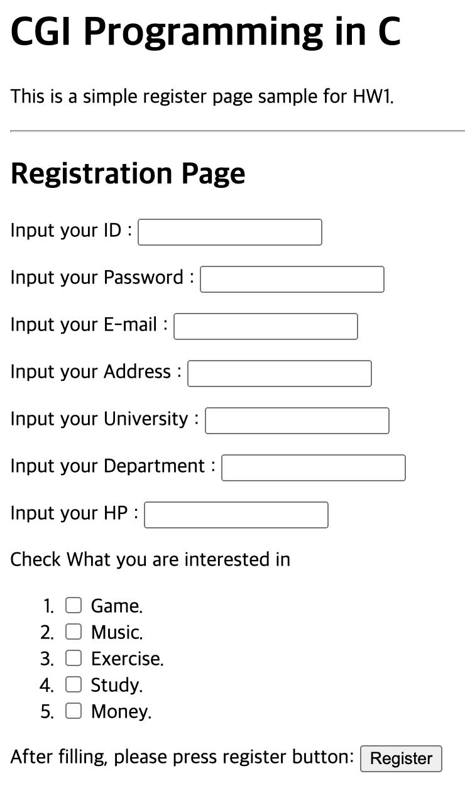
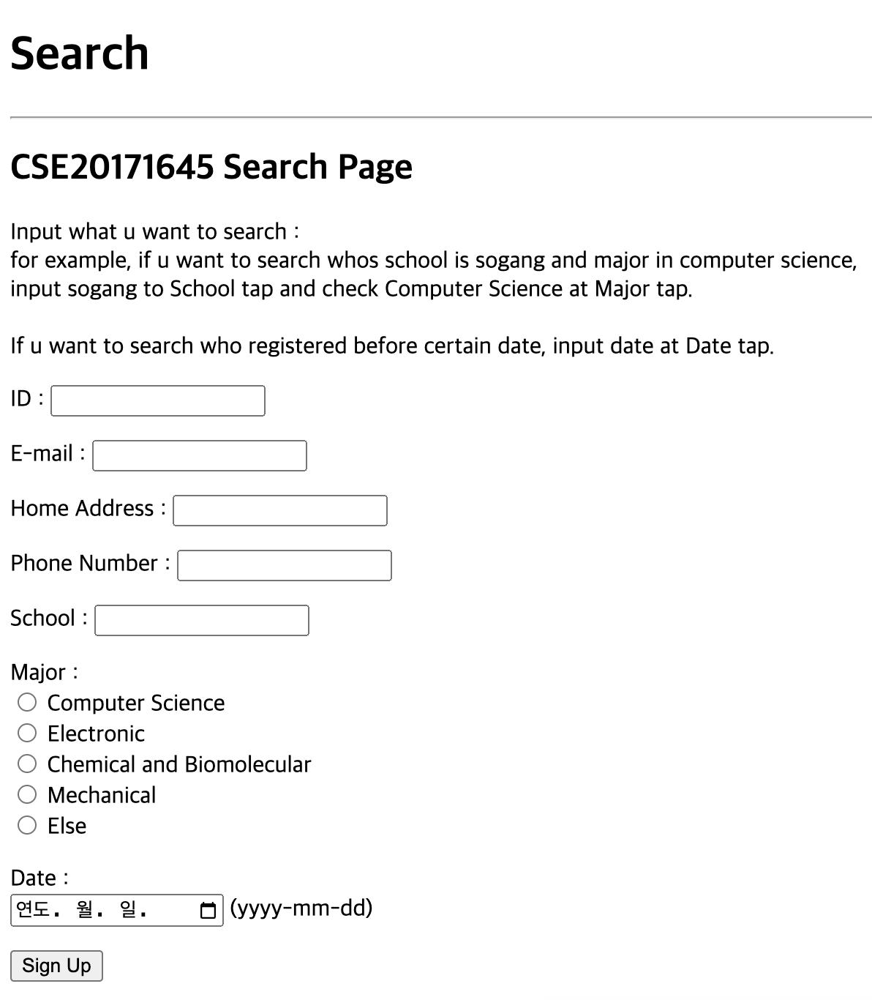
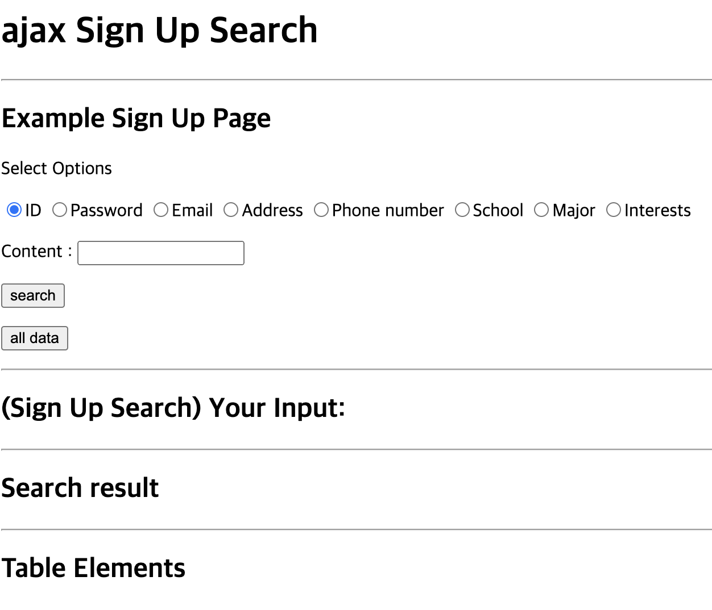

# Internet Programming
CSE 4117, Sogang Univ, Computer Science depart

## HW1

Code simple HTML file with HTML tags and input form

## HW2

Code HTML file using PHP CGI

## HW3

Code HTML file using ajax, XML and mysql

## HW4
